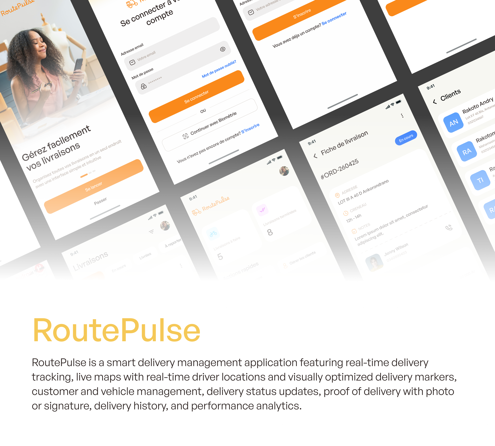

# RoutePulse

RoutePulse is a smart delivery management application for delivery drivers and small logistics teams. Drivers plan their day, follow their deliveries on a live map, update each delivery status from the field and collect a photo proof once the parcel is handed over. Clients and vehicles are managed inside the app, and the home screen summarizes the workload of the day. The mobile app is offline-first: every delivery, client and vehicle is stored locally and synchronized with the backend as soon as the connection is back. It is built as a monorepo with a Flutter mobile app and a NestJS backend.

## Link for Video demo

[Click to see demo](https://player.mux.com/x8PladvDztG5yh1Lu9Pu5J01bg02E2UEzLn7V3VBv3NVA)

## Features

### Mobile app

- [x] Onboarding screens
- [x] Sign up with email OTP verification, resend code and countdown
- [x] Login with JWT authentication
- [x] Biometric login with consent at sign up
- [x] Offline login and offline session through a locally signed token
- [x] Automatic token refresh and redirection to login when the session expires
- [x] Home screen with the KPIs of the day, next deliveries and quick actions
- [x] Delivery list with status filters, sorting and today / all period filter
- [x] Delivery creation in 4 steps: client, scheduling, articles, confirmation
- [x] Client search and creation directly from the delivery creatuib
- [x] Delivery details with articles, client information
- [x] Start a delivery, cancel with a reason, report to a new date and time slot
- [x] Delivery validation with photo proof and travelled kilometers
- [x] Live map with delivery markers and location picking
- [x] Client management
- [x] Vehicle management
- [x] Vehicle availability: a vehicle can be deactivated and hidden from the delivery form
- [x] Offline-first local database with automatic synchronization when back online
- [ ] Real time driver position sharing
- [ ] Signature as an alternative proof of delivery

### Backend

- [x] Versioned REST API served
- [x] JWT authentication with access and refresh tokens
- [x] Sign up through an email OTP cached in Redis, with attempt throttling
- [x] Biometric login endpoint, only for accounts that enabled it
- [x] bcrypt password hashing
- [x] PostgreSQL with Drizzle ORM and SQL migrations
- [x] Redis caching for OTP codes, client lists and signed image URLs
- [x] Per user encryption keys (AES-256-GCM)
- [x] Image storage on Supabase with signed URLs
- [x] Delivery workflow with status history: pending, in progress, delivered, cancelled, reported
- [x] Delivery filters: status, sorting, period, pagination
- [x] Delivery counters used by the home KPIs
- [x] Client and vehicle endpoints
- [x] Rate limiting, global exception filter and secrets managed with Infisical
- [ ] Real time channel for driver positions

## Tech stack

|         |                                                                                 |
| ------- | ------------------------------------------------------------------------------- |
| Mobile  | Flutter, Riverpod, GoRouter, Dio, Hive, Freezed                                 |
| Backend | NestJS, Drizzle ORM, PostgreSQL, Redis, Supabase Storage, Nodemailer, Infisical |
